# NABD نبض — read the land before the body

> *Nabd* means **pulse**. The land has one, and so does every worker on it.

**NABD is an early-warning system for heat, flood and dust in extreme environments.** It reads live satellite, weather and sensor data, works out *who* is at risk and *how*, and gets the warning to each worker **in their own language**. If there's no network, the warning hops from phone to phone.

📄 **[Pitch deck (PDF)](docs/NABD_pitch.pdf)** · 🧭 **[Architecture](docs/ARCHITECTURE.md)** · 🔬 **[Methods & validation](docs/METHODS.md)** · 🎤 **[Demo script](docs/SPEAKER_NOTES.md)** · 🔌 **[API](docs/API.md)**

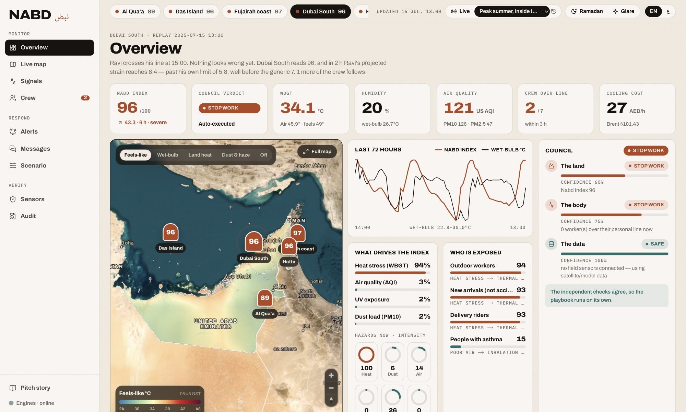
<sub>The Overview replaying 15 July 2025, 13:00 at Dubai South. The index reads 96, all three checks say STOP WORK, and Ravi (day 3 in the UAE) will cross his personal limit at 15:00.</sub>

## At a glance

| | |
|---|---|
| **Problem** | Warnings exist, but they don't reach the person: wrong time, wrong place, wrong language, no signal. |
| **What we built** | A working dashboard plus API: a hazard index with memory, an exposure graph, a personal limit for every worker, three independent checks, alerts in 8 languages and an off-grid phone relay. |
| **Proof** | Replaying real archived forecasts, it flagged the **16 April 2024 Hatta flood 39 hours early** and **25 of 25** black-flag heat days in August 2025 by 05:00. |
| **Who pays** | Contractors, oil & gas, utilities, delivery fleets and government. One maximum midday-ban fine (AED 50,000) covers about 20 months of a site licence. |
| **Cost to run** | Every data source is free and keyless. |

---

## 1. The problem: the warning existed, but it didn't reach the person

<table>
<tr>
<td width="50%">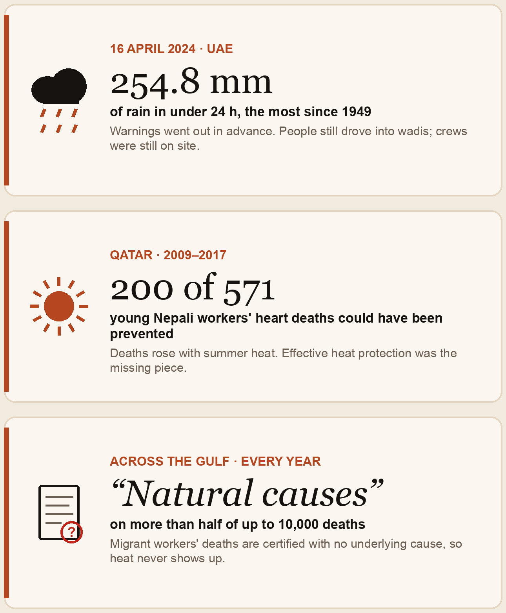</td>
<td width="50%">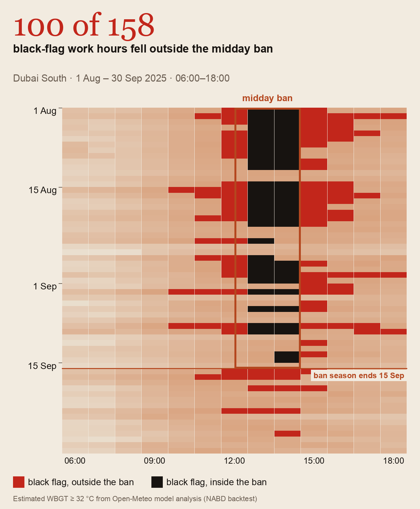</td>
</tr>
<tr>
<td><sub>Three real stories. None of them is a shortage of weather data.</sub></td>
<td><sub>The midday ban follows the calendar; danger doesn't. <b>100 of 158</b> black-flag work hours at Dubai South (Aug–Sep 2025) fell outside it.</sub></td>
</tr>
</table>

- **16 April 2024.** 254.8 mm of rain fell in under 24 hours, the most since UAE records began in 1949. Warnings went out in advance. People still drove into wadis, at least four people died, and Dubai airport cancelled 1,244 flights.
- **Qatar, 2009–2017.** As many as **200 of 571** cardiovascular deaths of young Nepali workers could have been prevented with effective heat protection (Pradhan et al., *Cardiology* 2019).
- **Across the Gulf,** as many as **10,000** migrant workers die each year, and more than half of those deaths are certified with no underlying cause (Vital Signs Partnership, 2022).

These are **last-mile failures**, caused by four gaps:

| Gap | Today | What a site needs |
|---|---|---|
| Calendar vs physics | Midday ban 12:30–15:00, 15 Jun–15 Sep | Danger by the hour, on any date |
| Region vs site | "Heavy rain in the eastern region" | "Stop block C at 11:00" |
| Language | Alerts in Arabic and English | Hindi, Malayalam, Tagalog, Urdu, Bengali… |
| Connectivity | SMS and apps | Something that works in a wadi with no signal |

**Scale:** 83.6% of workers in the Arab States are exposed to excessive heat, against a 71% global average (ILO 2024). Heat stress is projected to cost 2.2% of all working hours by 2030 (ILO 2019).

---

## 2. How it works, in six steps

1. **Data:** live satellite, weather and sensor data.
2. **Trust:** check whether that data can actually be trusted (signed sensors, physics and satellite cross-checks, our own red team).
3. **NABD Index:** combine it into one 0–100 index that **remembers** previous exposure (heat fades over hours, dust over a day, a warm sea over three days) and adds forecasts.
4. **Exposure:** ask *who* is actually at risk, and *how* (hazard → pathway → people → health outcome).
5. **Three checks:** the land, the body and the data must agree before anything automatic happens. If they disagree, a human decides.
6. **Alert:** the warning reaches the worker in their own language. With no network, it hops phone to phone.

<p align="center">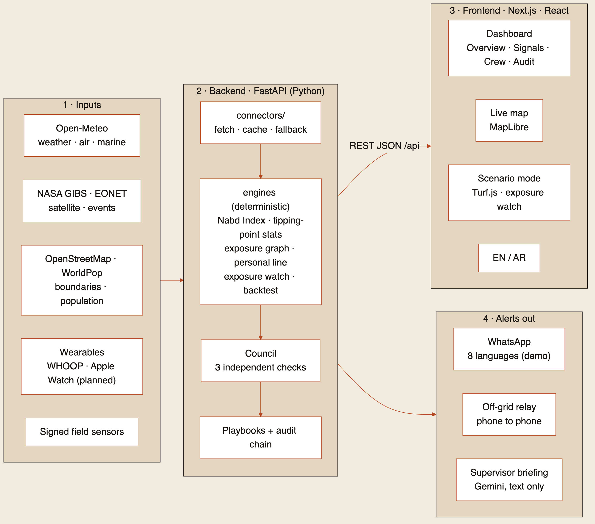</p>

**No language model makes a safety decision.** The engines are deterministic and every decision is written to a hash-chained audit log. Gemini only writes an optional supervisor briefing. Full diagrams: [docs/ARCHITECTURE.md](docs/ARCHITECTURE.md).

---

## 3. Proof: we replayed real days

We used the Open-Meteo **Previous Runs API**, so at every hour NABD only saw the forecasts that had actually been issued by then. A unit test checks that no future data leaks in.

| Case | Result |
|---|---|
| **Hatta flood, 16 April 2024** | Flagged **39 hours** before the danger threshold (observations alone: 3 hours) |
| **Dubai South, August 2025** | **25 of 25** black-flag days flagged by 05:00 · false-alarm ratio **0.19** |
| **Dubai South, September 2025** | **14 of 14** flagged · false-alarm ratio **0.53** (it over-warns, on purpose) |

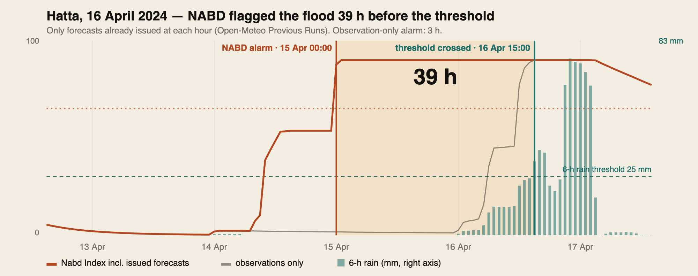

To be upfront: the lead time comes from **public forecasts plus the index's memory**, 7 of 9 flood alarm periods were false, and the reference values are model analysis. Method, statistics and sources: [docs/METHODS.md](docs/METHODS.md).

---

## 4. What you can see in the demo

### A personal line for every worker
A generic limit treats a man on day 3 like a man in year 9. Each worker's strain limit moves with acclimatisation, age and Ramadan fasting, and learns from supervisor feedback within safe bounds.

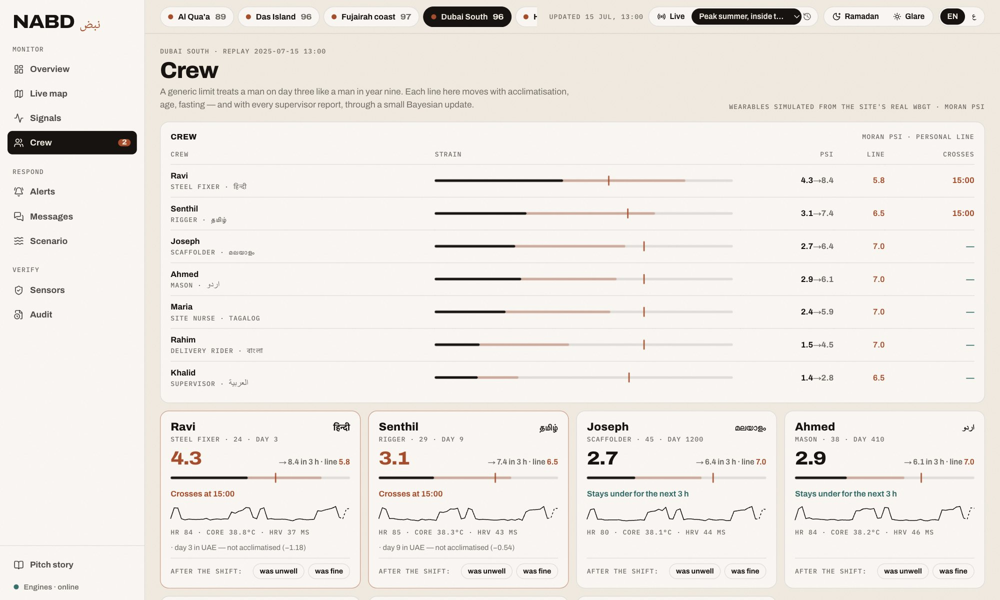

### Messages in the way workers actually type
Hindi in Latin letters, Arabizi, English mixed in. The intake reads 8 languages on the device, with no LLM. Symptoms raise that worker's strain, the council re-votes, and the reply goes back in their language.

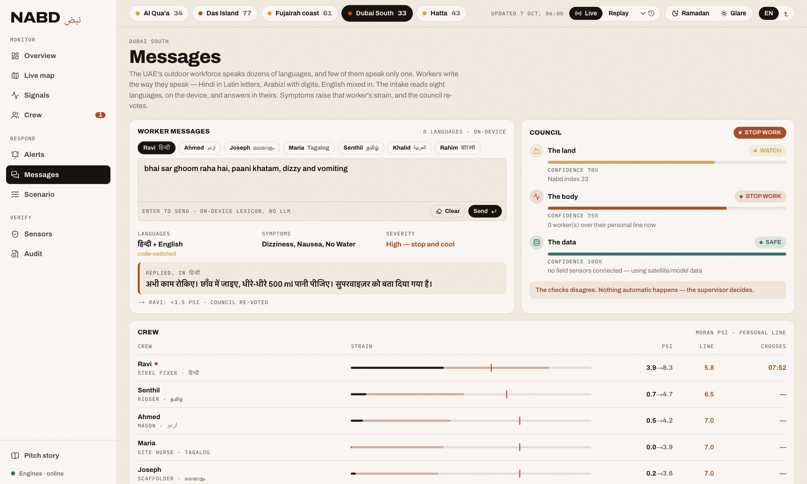

### Alerts that work with no network
The site office sends one **21-byte signed frame**, small enough for a single Bluetooth LE advertisement. Each phone verifies it, relays it and shows it in its owner's language. UAE playbooks (work–rest cycles, hydration, shifting heavy tasks) run alongside.

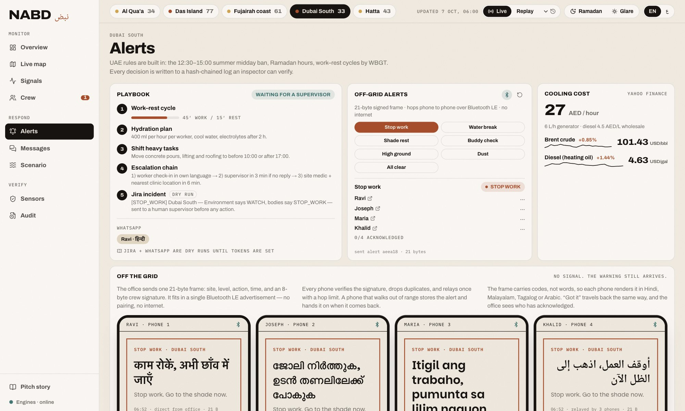

### Scenario mode: plan before the storm, warn during it
Pick a district with its **real OpenStreetMap boundary** or draw a zone: NABD shows the people inside (WorldPop), the area and the mapped buildings. Exposure watch then pulls **live** temperature, humidity and UV, turns them into a safe time in the sun, and alerts anyone past it on WhatsApp in their language.

<table>
<tr>
<td width="64%">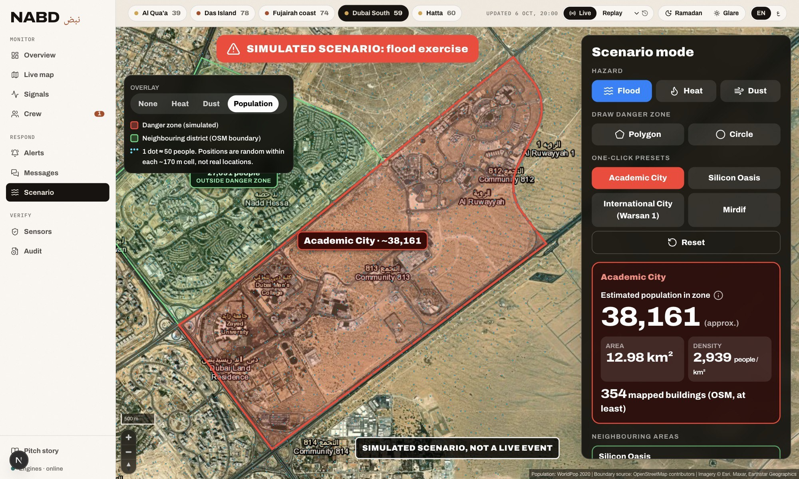</td>
<td width="36%">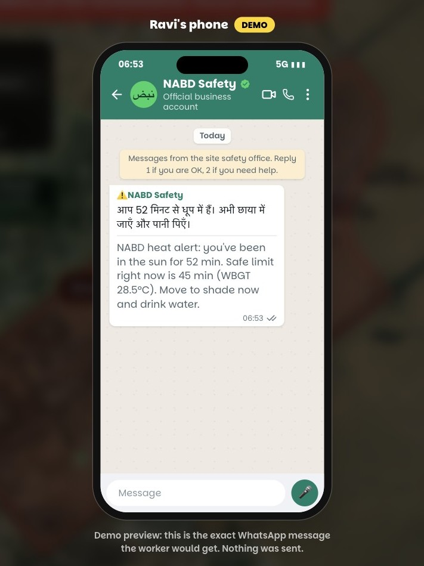</td>
</tr>
<tr>
<td><sub>Academic City: ~38,200 modelled residents, 12.98 km², at least 354 mapped buildings.</sub></td>
<td><sub>The WhatsApp alert as Ravi would see it. In the demo it's a preview; nothing is sent.</sub></td>
</tr>
</table>

### Live map
HD satellite imagery, a live feels-like heat field over the UAE, and NASA land-heat and dust layers.

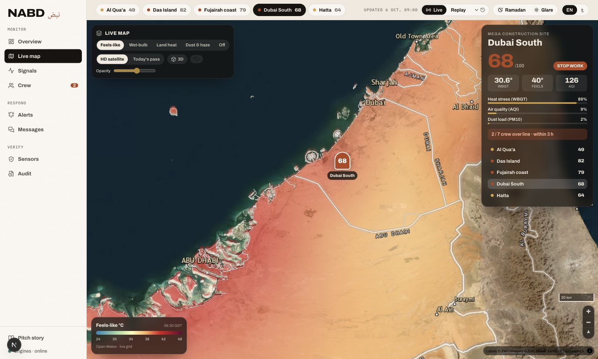

---

## 5. What's real and what's simulated

| Real, live or archived | Simulated, and labelled on screen |
|---|---|
| Weather, air quality and marine data (Open-Meteo) | Wearable heart rate and temperature, derived from each site's real WBGT |
| Archived forecasts for the backtest | The people in Scenario mode and their time outdoors |
| NASA GIBS satellite layers and EONET events | The flood zone itself |
| OpenStreetMap boundaries and buildings, WorldPop population | WhatsApp delivery (a demo preview unless keys are set) |
| Oil and diesel prices for the cooling-cost panel | Bluetooth between phones (the browser's BroadcastChannel stands in for BLE) |

---

## 6. Why people would buy it

- **Compliance:** midday-ban violations cost **AED 5,000 per worker, up to AED 50,000** (MoHRE 2025). The audit log proves the site acted on each warning, for inspectors, insurers and ESG reports.
- **Fewer incidents:** one heat stroke offshore means an evacuation and a stopped platform.
- **More safe working hours:** crews shift work into the safe hours the forecast shows instead of losing the day.
- **Low running cost:** free, keyless public data.

**Buyers:** construction contractors and mega-projects; oil, gas and utilities, including desalination; delivery and logistics fleets; government emergency management and labour inspection.

**Model:** a per-site subscription plus worker seats (hypothesis: ~AED 2,500 per site per month). Sold through HSE consultancies and insurers: start with one contractor for one summer, then expand across the GCC.

---

## 7. Honest limits and next steps

| Limit today | Next step |
|---|---|
| Wearables are simulated | Pilot with **WHOOP bands and Apple Watch** (WHOOP API, Apple HealthKit); the engine stays the same |
| The lead time comes from forecasts; tipping-point statistics are context | Keep them as context; add satellite chlorophyll and vegetation (NDVI) |
| Heat alarms over-warn (false-alarm ratio 0.53 in September) | Calibrate thresholds with local incident data |
| iOS limits background Bluetooth; the demo crew shares one key | Android first; per-device keys signed by the site office, with revocation |
| Exposure-graph weights are priors | Fit them to local incident data |

Full list: [docs/METHODS.md](docs/METHODS.md#full-list-of-limits).

---

## 8. Tech stack

| Layer | What |
|---|---|
| Frontend | Next.js 16, React 19, Tailwind 4, MapLibre GL, Turf.js, English/Arabic with right-to-left layout |
| Backend | Python, FastAPI, httpx; deterministic engines; 16 offline tests |
| Data | Open-Meteo (forecast, archive, previous runs, air quality, marine), NASA GIBS and EONET, OpenStreetMap, WorldPop |
| Out | WhatsApp Cloud API (demo by default), 21-byte signed BLE frame, hash-chained audit log |

## Run it

Requirements: Python 3.11+ and Node 20+.

```bash
# Backend: FastAPI on :8040
cd backend && python3 -m venv .venv && source .venv/bin/activate
pip install -r requirements.txt
uvicorn nabd.main:app --host 127.0.0.1 --port 8040
pytest                       # 16 offline tests
python -m scripts.validate   # regenerate validation numbers and charts

# Frontend: Next.js on :3848
cd frontend && npm install && npm run dev
```

Open <http://127.0.0.1:3848>. Try **Replay → "Peak summer, inside the midday ban"** in the top bar, then **Scenario → Academic City → the WhatsApp button**.

| Page | What it shows |
|---|---|
| `/` | Overview: index, council, map, crew, playbook, off-grid alerts |
| `/signals` | Tipping-point statistics, validation backtest, exposure graph |
| `/crew` · `/messages` · `/alerts` | Personal lines · multilingual intake · playbooks and relay |
| `/scenario` | Scenario mode and exposure watch |
| `/map` · `/story` · `/relay?slot=0..4` | Full-screen map · pitch story · a single off-grid phone |

**Optional keys** go in `NABD/.env`, which is git-ignored: `GEMINI_API_KEY` (supervisor briefing only), `WHATSAPP_TOKEN`, `WHATSAPP_PHONE_NUMBER_ID`, `WHATSAPP_TEST_TO`. See `.env.example`.

**Population data for Scenario mode.** Without this step, the map uses a labelled sample grid. Download [`are_ppp_2020_UNadj.tif`](https://data.worldpop.org/GIS/Population/Global_2000_2020/2020/ARE/are_ppp_2020_UNadj.tif) from WorldPop, then run `pip install rasterio numpy && python scripts/prep_population.py are_ppp_2020_UNadj.tif --step 2 --min 5`.

---

<sub>Boundary source: OpenStreetMap contributors · Population: WorldPop 2020 · Weather: Open-Meteo · Imagery: NASA GIBS, Esri. Full sources in [docs/METHODS.md](docs/METHODS.md#sources).</sub>
