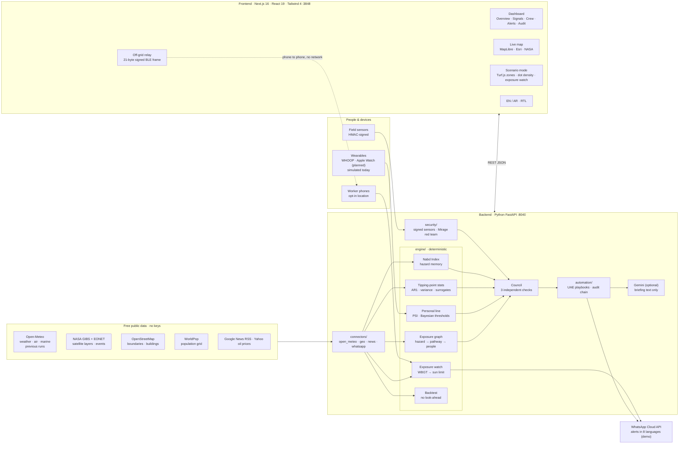
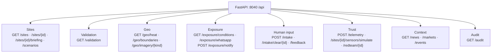
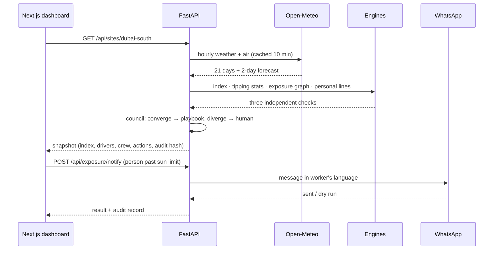

# NABD — tech stack and data flow

## One-line answer

A **Next.js** dashboard talks to a **FastAPI** backend. The backend pulls free public data, runs deterministic engines (no LLM in any decision), and pushes alerts out over WhatsApp, a phone-to-phone mesh, and a hash-chained audit log.

## Architecture

## Backend endpoints (FastAPI)

## One request, end to end

## If someone asks

- **Why FastAPI?** It's async, so it fetches several data sources in parallel, and it generates typed APIs from Pydantic. The engines are plain Python and easy to test: 16 offline tests.
- **Why no LLM in decisions?** Safety calls must be deterministic and auditable. Gemini only writes the optional supervisor briefing.
- **Wearables?** The engine takes heart rate and core/skin temperature. Today those are simulated from each site's real WBGT. The plan is **WHOOP** (WHOOP developer API: heart rate, HRV, skin temperature, strain) and **Apple Watch** (HealthKit via a small iOS companion app). The engine doesn't change; only the input stream is swapped.
- **Offline?** Boundaries and population are saved files, the backend keeps a disk cache, and alerts can hop phone to phone with no network.
- **Cost to run?** Every data source is free and keyless. WhatsApp Cloud API charges per conversation beyond the free tier.
